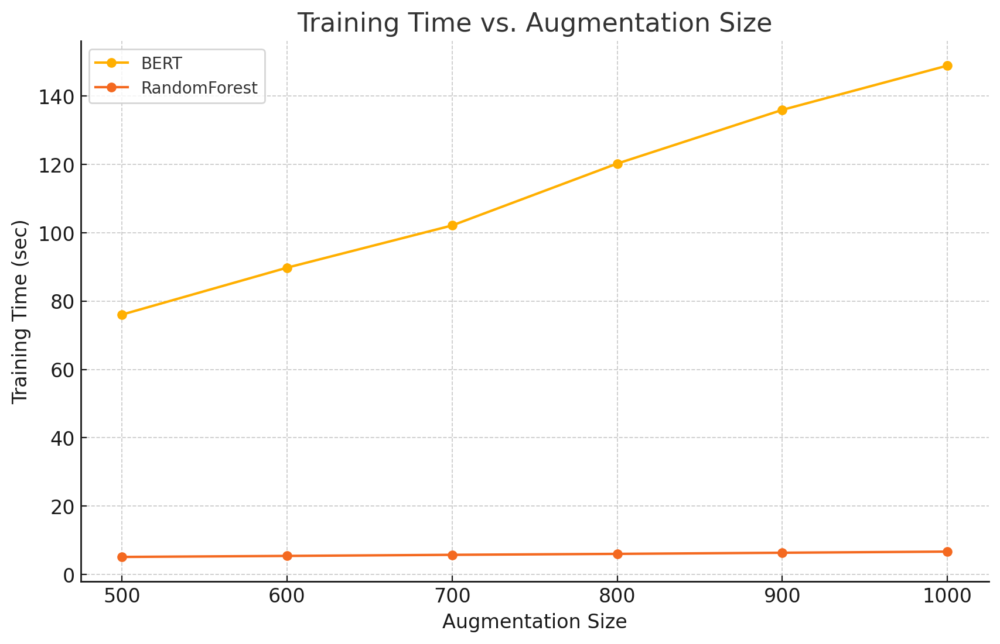

# Emotion Classification on X/Twitter

Robust, modular NLP pipeline for 6-way emotion classification (anger, fear, joy, love, sadness, surprise) — rebuilt professionally from our Duke ECE Data Science final project.

   

## Why This Repo
- Interview-grade structure: clean modules, CLI, artifacts, and figures.
- Solid baseline: strong RF pipeline; optional DistilBERT starter.
- Reproducible: fixed splits, metrics logging, and training curves.
- Realistic data: X API sampling + LLM augmentation (documented below).

## Project Structure
- `src/emotion_nlp`: Core library with data loading, preprocessing, models, training, and evaluation.
- `data`: Raw class files (`*_1000_clean.txt`) used to construct splits.
- `assets`: Figures used in the README; generated plots go in `assets/generated/`.
- `artifacts`: Auto-created during runs for saved splits and metrics.
- `scratch`: Archive of the original project files (not used by the new pipeline).

## Results (from Our Report)
- BERT > RF at small data; RF nearly catches up with more augmentation.
- Both models can reach >0.98 accuracy and >0.998 AUC with ample data.
- RF is dramatically faster to train (practical for constrained settings).

You can find the original figures in `assets/` and the full report at `docs/final_report.pdf`.

  
  
  
  
  

## TL;DR — Run in 60 Seconds
- `pip install -r requirements.txt`
- `pip install -e .`  (enables the CLI and proper imports)
- Put the six class files in `data/`:
  - `anger_1000_clean.txt`, `fear_1000_clean.txt`, `joy_1000_clean.txt`, `love_1000_clean.txt`, `sad_1000_clean.txt`, `surprise_1000_clean.txt`
- Train baseline and export artifacts:
  - `emotion-nlp --data-dir data`
  - Or: `python -m emotion_nlp --data-dir data`

### What You Get
- Splits: `artifacts/data/train.csv`, `val.csv`, `test.csv`
- Metrics: `artifacts/rf_metrics.txt`
- Curve: `assets/generated/training_curve_rf.png`

## Data Acquisition
- X/Twitter API (via Tweepy, developer account): we sampled user-authored content for each emotion tag (joy, love, fear, anger, surprise, sadness), then cleaned and human-verified to retain 100 high-quality originals per class.
- LLM augmentation (ChatGPT‑4o): we generated +900 sentences per class using a strict prompt to enforce diversity and clarity. We repeated the 100-sample prompt nine times per class to reach ~1,000 examples/class.

### Notes
- Cleaning removed non-English content, special characters/URLs, and incomplete sentences. We also handle edge-case delimiters (semicolons) consistently in the loader.
- See `docs/final_report.pdf` for methodology, experiments, and analysis.

## Optional: BERT Fine-Tuning (DistilBERT)
- We provide a minimal initializer in `src/emotion_nlp/models.py` to grab the tokenizer/model. For full fine‑tuning, adapt a Hugging Face `Trainer`-based script in this structure.

## Library Overview
- `src/emotion_nlp/data.py`: Reads the six class files, applies semicolon-fix cleaning, shuffles, and splits into train/val/test; `build_splits` and `save_splits`.
- `src/emotion_nlp/preprocess.py`: `TextProcessor` transformer with case‑folding, non‑alpha removal, optional stemming, stopwords.
- `src/emotion_nlp/models.py`: `build_rf_pipeline` (CountVectorizer + RF); optional `build_distilbert` initializer.
- `src/emotion_nlp/evaluate.py`: Accuracy, confusion, classification report; macro/micro AUC when probabilities are available.
- `src/emotion_nlp/train.py`: CLI for the RF baseline; exports metrics and a training curve.

## Design & Reproducibility
- Fixed-seed shuffle and deterministic splits.
- Consistent metrics across splits; AUC computed one-vs-rest (macro/micro).
- NLTK stopwords by default; if offline, disable or pre-download corpus.

## Roadmap
- Add TF‑IDF/LogReg and Linear SVM baselines.
- Plug a HF `Trainer`-based script with wandb logging.
- Provide grid search and CV utilities.

## Acknowledgements
- Final group project for Duke University’s ECE Data Science. Thanks to course staff and collaborators. The original code and write-up are preserved under `scratch/` and `docs/`.
